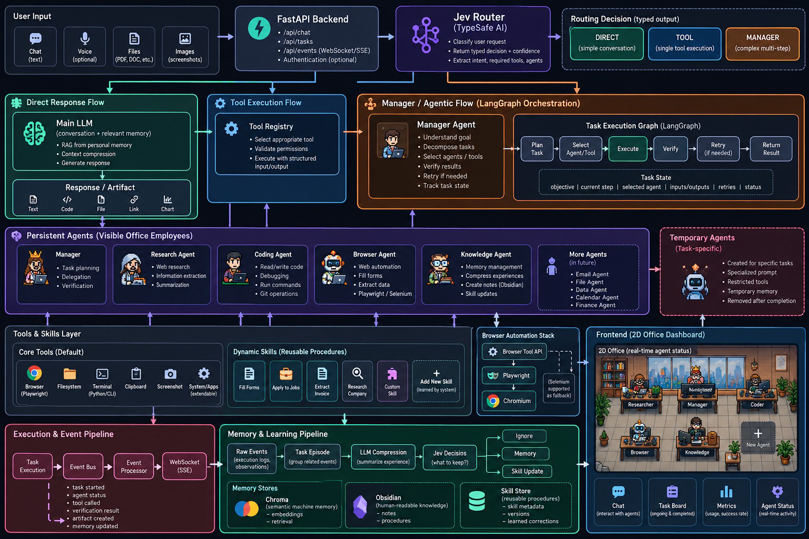

# 🏢 Agentic AI Office (Version 1)

A local-first, minimal, genuinely functional virtual AI company built with **Python**, **FastAPI**, **LangGraph**, and an interactive **2D pixel-art office simulation**.


---

## 🏛️ System Architecture


*Figure 1: High-level system architecture — connecting the interactive 2D Office UI, FastAPI routes, 3-way intent router, LangGraph multi-agent execution pipeline, memory compression, and tools layer.*

---

## 🌟 Core Concepts Demonstrated

1. **Generic AI Agent**: A single, reusable agent engine driven by structured configuration (`AgentConfig`), dynamic tools, memory notes, and injected experiences.
2. **LLM-Powered Orchestrator (Manager Jordan)**: Assesses incoming tasks, checks workforce capability, decides whether an existing agent or a temporary specialist is needed, and routes retrieval.
3. **LangGraph Workflow**: A state-driven cyclic graph (`START` &rarr; `Orchestrator` &rarr; `Agentic RAG` &rarr; `Generic Agent` &rarr; `Evaluator` &rarr; `Experience Summarizer` &rarr; `END`) with bounded retry loops.
4. **Permanent Agents**: Created via natural-language prompts (e.g. *"Create Elena, a Data Scientist specializing in statistical analysis"*), parsed into validated configurations, and saved to SQLite across sessions.
5. **Temporary Specialists**: Dynamically created on-the-fly when the current workforce lacks domain expertise, execute the task, and are archived and depart from the office upon completion.
6. **Agentic RAG**: The system autonomously decides whether external company documentation is needed before querying the local vector store.
7. **3-Tier Memory Separation**:
   - *Ephemeral Task State* (inside LangGraph execution)
   - *Persistent Agent Memory* (agent-specific notes/preferences stored in SQLite)
   - *Experience Memory* (distilled organizational learnings retrieved for future tasks)
8. **Human Feedback Adaptation**: User ratings (1–5 stars) and comments refine future task execution without model fine-tuning (distinct from RLHF).
9. **Backend Event System**: 13 strictly typed events persisted to SQLite and streamed in real-time over WebSockets to synchronize the office frontend.
10. **2D Pixel-Art Office Visualization**: HTML5 Canvas rendering desks, computers, manager executive suite, character walking pathfinding, typing animations, and real-time speech bubbles.

---

## 🚀 Quick Start

### 1. Prerequisites
- Python 3.12+ installed
- Git

### 2. Clone & Setup
```bash
# Clone the repository
git clone https://github.com/Puttameher/agenoffice.git
cd agenoffice

# Create and activate virtual environment
python -m venv venv
.\venv\Scripts\activate   # On Windows
source venv/bin/activate  # On Linux/macOS

# Install dependencies
pip install -r backend/requirements.txt
```

### 3. Configure LLM (Optional)
The project runs **100% out of the box** with a built-in intelligent simulated LLM fallback (no API keys required for testing and demos!).

To connect a live LLM (OpenAI / Groq / Ollama / etc.), create a `.env` file in the project root:
```env
OPENAI_API_KEY=your_openai_api_key_here
OPENAI_MODEL_NAME=gpt-4o-mini
# OPENAI_BASE_URL=http://localhost:11434/v1  # (For local Ollama)
```

### 4. Run the Server
```bash
python -m uvicorn backend.app.main:app --reload --port 8000
```

Open your browser and navigate to:
👉 **[http://localhost:8000/](http://localhost:8000/)**

---

## 🧪 Running Automated Tests

Run the comprehensive pytest suite covering agent execution, tools, LangGraph orchestration, agentic RAG, temporary agent lifecycle, and REST APIs:

```bash
pytest backend/tests
```

---

## 📁 Repository Structure

```
agenoffice/
├── backend/
│   ├── app/
│   │   ├── agents/          # Generic agent engine & natural-language factory
│   │   ├── api/             # FastAPI REST routes & WebSocket event manager
│   │   ├── config.py        # Environment settings & constants
│   │   ├── database/        # SQLite connection & CRUD repository
│   │   ├── evaluation/      # Task result evaluator (success, score, reason)
│   │   ├── events/          # Central event bus emitting 13 core events
│   │   ├── llm.py           # Configurable LLM client & simulated fallback
│   │   ├── memory/          # 3-tier memory store (task, agent, experiences)
│   │   ├── models/          # Pydantic data schemas
│   │   ├── orchestration/   # LangGraph workflow, state, & experience summarizer
│   │   ├── retrieval/       # Lightweight vector store & RAG documents
│   │   ├── tools/           # Calculator & safe Python code sandbox
│   │   └── main.py          # FastAPI startup, lifespan, & static mounting
│   ├── tests/               # Pytest automated test suite
│   └── requirements.txt     # Backend Python dependencies
├── frontend/
│   ├── index.html           # Retro-modern dashboard layout
│   ├── style.css            # Dark pixel-art aesthetic styling
│   └── src/
│       ├── main.js          # App boot, WebSocket sync, & UI controller
│       └── office/
│           ├── canvas.js    # Canvas rendering (parquet floor, desks, chairs)
│           ├── characters.js# Pixel avatar sprites, walking animations, speech
│           └── officeManager.js # Binds backend events to character animations
├── docs/
│   ├── PROJECT_GUIDE.md     # Deep file-by-file walkthrough & end-to-end trace
│   └── INTERVIEW_GUIDE.md   # 17 technical interview questions & code-grounded answers
└── README.md
```

---

## 📖 In-Depth Guides

- 📋 **[docs/PRD.md](file:///d:/youtube/agenoffice/docs/PRD.md)**: Full Product Requirements Document (PRD) detailing every feature, flow, function, API endpoint, and schema.
- 📘 **[docs/PROJECT_GUIDE.md](file:///d:/youtube/agenoffice/docs/PROJECT_GUIDE.md)**: Deep dive into the backend architecture, function inputs/outputs, caller graphs, and an end-to-end 17-step task execution trace.
- 🎓 **[docs/INTERVIEW_GUIDE.md](file:///d:/youtube/agenoffice/docs/INTERVIEW_GUIDE.md)**: Master the 17 core interview questions with direct code references (LangGraph vs DAGs, memory vs experience, RLHF distinction, loop prevention, and event-driven architectures).
